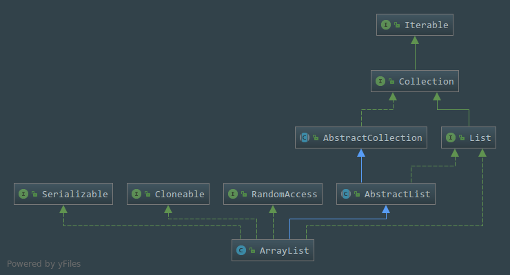

# 浅析ArrayList(JDK1.8)
## 一. ArrayList类的声明
````java
public class ArrayList<E> extends AbstractList<E>
        implements List<E>, RandomAccess, Cloneable, java.io.Serializable
````

 - 继承了`AbstractList`父类,父类里面已经有了基本的增删改查的方法了
 - 实现了`List`接口,这里相当于一个数组队列了,通俗点就是动态数组,长度是可以随时扩展的
 - 实现了`RandomAccess`接口,这个接口是专门为`List`实现的,实现了这个接口表明是支持快速随机访问的,这个接口里面没有定义任何方法
 - 实现`Cloneable`接口,表明了这个类是支持被克隆的,因为覆盖了`clone()`方法
 - 实现了`Serializable`接口,支持序列化差均属以及反序列化传输
## 二. 类的属性
- 默认的数组容量大小就是10  
```java
private static final int DEFAULT_CAPACITY = 10;
```
- 空的常量数组
```java
    private static final Object[] EMPTY_ELEMENTDATA = {};
```
- 默认空的常量数组
 ```java
    private static final Object[] DEFAULTCAPACITY_EMPTY_ELEMENTDATA = {};
```
- 存放数据的数组,所以ArrayList底层实现还是数组,任何空的ArrayList中的``with elementData == DEFAULTCAPACITY_EMPTY_ELEMENTDATA``,这个属性算是本类里面最核心的属性了,大部分的方法都是在操作这个属性    
```java
    transient Object[] elementData; // non-private to simplify nested class access
````
- 分配数组的最大长度值
```java
 private static final int MAX_ARRAY_SIZE = Integer.MAX_VALUE - 8;
```

- 数组中元素的大小
````java
    private int size;
````

---

## 三.类的构造方法

- ###       无参的构造方法

```java
    /**
     * Constructs an empty list with an initial capacity of ten.
     * 注意这个方法的注释,在JDK8以前的方法体是this(10),也就是默认就是默认初始化容量大小为10的数组,但是到了JKD8中被替换成了this.elementData = DEFAULTCAPACITY_EMPTY_ELEMENTDATA,在论坛上找到据说是惰性初始化
     */
public ArrayList() {
        // 默认无参实例化就是默认空的常量数组
        this.elementData = DEFAULTCAPACITY_EMPTY_ELEMENTDATA;
    }
```
- ###       有参的构造方法
- 传入int类型的数值指定初始化数组容量大小
```java
public ArrayList(int initialCapacity) {
        // 如果容量大小大于0的话说明是个合法的数据,就初始化该大小的一个Object数组
        if (initialCapacity > 0) {
            this.elementData = new Object[initialCapacity];
        // 容量大小为0的话就是等于空的常量数组
        } else if (initialCapacity == 0) {
            this.elementData = EMPTY_ELEMENTDATA;
        // 其他的可能就是一个不合法的容量大小了
        } else {
            throw new IllegalArgumentException("Illegal Capacity: "+
                                               initialCapacity);
        }
    }
```
- 传入一个实现了`Collection`接口的类型数据,使用泛型限制了数据类型
````java
public ArrayList(Collection<? extends E> c) {
       // 把该类型转换为一个Object数组类型
        elementData = c.toArray();
        // 把上面转换到的Object数组的长度复制给ArrayList中的size属性,然后判断是否等于0
        
        
        if ((size = elementData.length) != 0) {
            // c.toArray might (incorrectly) not return Object[] (see 6260652)
            // 如果数组数据类型不等于Object的话就转换成一个Object类型的数组
            if (elementData.getClass() != Object[].class)
                elementData = Arrays.copyOf(elementData, size, Object[].class);
        } else {
            // replace with empty array.
            this.elementData = EMPTY_ELEMENTDATA;
        }
    }
````

---
## 四.方法

- trimToSize方法,设置当前数组的长度为当前数组元素的长度,可以减少内存的占用
```java
 public void trimToSize() {
        modCount++;
        if (size < elementData.length) {
            elementData = (size == 0)
              ? EMPTY_ELEMENTDATA
              : Arrays.copyOf(elementData, size);
        }
    }
```

- ensureCapacity方法,供外部使用的调整数组容量大小的方法,若当前的容量不足以容纳当前所有的元素的话就进行扩充
````java
public void ensureCapacity(int minCapacity) {
        // 首先判断集合里面的数据是否为空,为空最小扩充值为0,否则就是默认的容量大小,也就是10
        int minExpand = (elementData != DEFAULTCAPACITY_EMPTY_ELEMENTDATA)
            // any size if not default element table
            ? 0
            // larger than default for default empty table. It's already
            // supposed to be at default size.
            : DEFAULT_CAPACITY;
        
       // 如果当前所有元素的长度大于当前数组的长度,也就是大于最小要被扩容的长度的时候就进行扩容
        if (minCapacity > minExpand) {
            ensureExplicitCapacity(minCapacity);
        }
    }
````

- ensureExplicitCapacity方法,一个类的私有的方法,确定一个明确的容量
````java
   private void ensureExplicitCapacity(int minCapacity) {
        //  修改统计次数+1
        modCount++;

        // overflow-conscious code
        // 需要检查的最小的容量值- 元素数据的长度 大于0,就进行扩充操作
        if (minCapacity - elementData.length > 0)
            grow(minCapacity);
    }
````

- ensureCapacityInternal方法,供类内部使用的一个判断容量是否溢出的方法
````java
private void ensureCapacityInternal(int minCapacity) {
        if (elementData == DEFAULTCAPACITY_EMPTY_ELEMENTDATA) {
             // 返回默认的容量值跟需要检查的最小容量值中间更大的那个数
            minCapacity = Math.max(DEFAULT_CAPACITY, minCapacity);
        }
        
        ensureExplicitCapacity(minCapacity);
    }
````

- grow方法,用于扩充数组的长度的方法
```java
private void grow(int minCapacity) {
        // overflow-conscious code
        // 老的容量值应该是数组数据长度的值
        int oldCapacity = elementData.length;
        // 新的容量值是老的容量值加上老的容量值右移一位,也就是相当于是除以2,也就是相当于(1+（1/2）),就是扩容1.5倍,简单地理解就是左移是乘,右移是除,不过其实也不是这样,这里牵扯到二进制的运算,什么最高位,空格位之类的,又想起来了51单片机中的汇编来了。。。。
        int newCapacity = oldCapacity + (oldCapacity >> 1);
        // 信的容量-最小检查的容量小于0就说明最小检查容量更大,欣荣亮亮就等于最小检查容量
        if (newCapacity - minCapacity < 0)
            newCapacity = minCapacity;
        // MAX_ARRAY_SIZE的值是2147483639,这个值就是一开始的一个属性,值为Integer的最大值-8,如果新容量-最大的数组长度值大于0的话,就调用hugeCapacity方法处理
        if (newCapacity - MAX_ARRAY_SIZE > 0)
            newCapacity = hugeCapacity(minCapacity);
        // minCapacity is usually close to size, so this is a win:
        // 把原来的数组内容复制到新的数组里面去,实现数组的动态扩容
        elementData = Arrays.copyOf(elementData, newCapacity);
    }
```

- hugeCapacity方法,检查数组长度是否存在溢出情况
````java
private static int hugeCapacity(int minCapacity) {
      // 最小检查容量都小于0了就肯定要溢出了
        if (minCapacity < 0) // overflow
            throw new OutOfMemoryError();
        // 超过这个值就设置数组长度为Integer的最大值,否则就是MAX_ARRAY_SIZE的值,也就是是2147483639
        return (minCapacity > MAX_ARRAY_SIZE) ?
            Integer.MAX_VALUE :
            MAX_ARRAY_SIZE;
    }
````

- toArray方法,讲集合转换为原声Object数组,这个方法是连接集合跟数组间的一个桥梁
```java
public Object[] toArray() {
        return Arrays.copyOf(elementData, size);
    }
```

- get方法,指定下标获取元素

```java
public E get(int index) {
    // 检查下标是否合法
        rangeCheck(index);

        return elementData(index);
    }
```

- set方法,设置指定下标的元素内容
```java
public E set(int index, E element) {
        rangeCheck(index);

        E oldValue = elementData(index);
        elementData[index] = element;
        return oldValue;
    }
```

- add方法,添加元素到集合里面去
```java
     // 不指定下标添加元素,默认就是在最尾部添加
    public boolean add(E e) {
       // 调整容量
        ensureCapacityInternal(size + 1);  // Increments modCount!!
        // 使用数组的方法设置元素,其中数组的长度以及扩充+1了,所以size++就是数组的最后一个位置
        elementData[size++] = e;
        return true;
    }

     // 这个方法就是指定下标进行插入,这样插入的话后面的元素都要往后移动,其实也就是一个复制到新数组的流程
    public void add(int index, E element) {
      // 检查下标是否合理
        rangeCheckForAdd(index);
        // 调整容量
        ensureCapacityInternal(size + 1);  // Increments modCount!!
        // 把内容复制到新数组里面去
        System.arraycopy(elementData, index, elementData, index + 1,
                         size - index);
         // 使用数组的方法设置数组的内容                
        elementData[index] = element;
        size++;
    }
```


